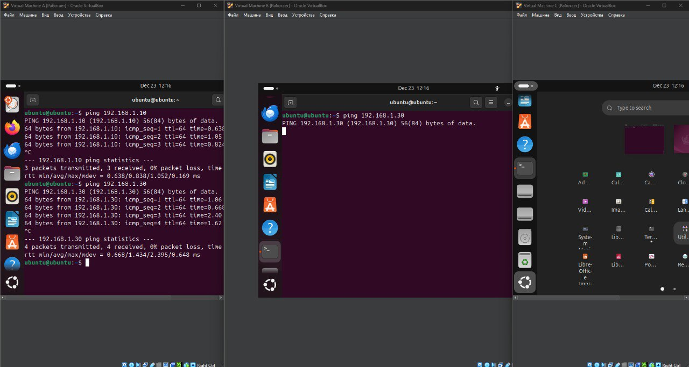

### 1. Настройка виртуальной машины А
Установил Ubuntu в VirtualBox
При настройке сети выбрал Bridge Adapter
После установки проверил доступ в интернет командами:
```bash
ping 8.8.8.8
ping google.com
```

### 2. Настройка виртуальных машин В и С
Создал еще две виртуальные машины с такой же ОС
Настройте сетевые интерфейсы:
Для всех машин добавил второй сетевой адаптер типа  Internal Network

### 3. Настройка сети
На машине А выполнил:
```bash
sudo ip addr add 192.168.1.20/24 dev enp0s3
```
На машине В:
```bash
sudo ip addr add 192.168.1.10/24 dev enp0s3
```
На машине С:
```bash
sudo ip addr add 192.168.1.30/24 dev enp0s3
```

### 4. Настройка правил межсетевого экрана
На машине В добавил правило для блокировки доступа к машине С:
```bash
sudo iptables -A FORWARD -s 192.168.1.10 -d 192.168.1.30 -j DROP
```
### 5. Проверка доступности
Для проверки связи использовал команду ping:
```bash
# На машине А:
ping 192.168.1.10  # должно работать
ping 192.168.1.30  # должно работать

# На машине В:
ping 192.168.1.30  # не должно работать

# Сетевое взаимодействие между виртуальными машинами



## Схема доступности сетевых подключений

- ✅ Машина A (192.168.1.20) → Машина B (192.168.1.10)
- ✅ Машина A (192.168.1.20) → Машина C (192.168.1.30)
- ❌ Машина B (192.168.1.10) → Машина C (192.168.1.30)